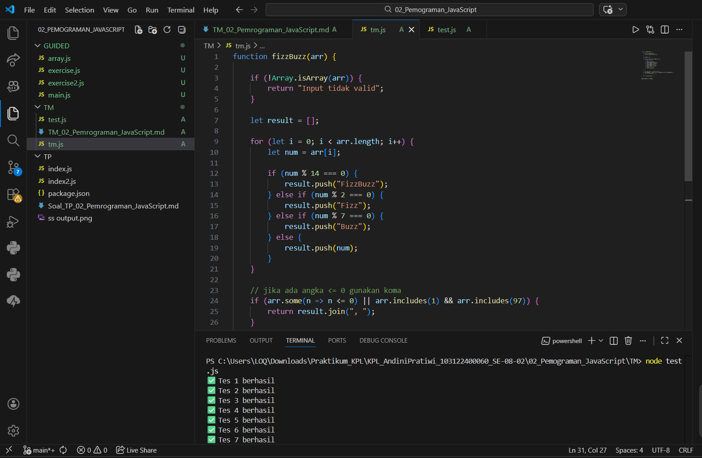

#TUGAS Mandiri 02: Pemrograman JavaScript

Soal: Buatlah sebuah fungsi bernama fizzBuzz yang menerima input larik (array) dan mengembalikan deretan bilangan dan "Fizz" untuk kelipatan 2, "Buzz" untuk kelipatan 7, dan "FizzBuzz" untuk kelipatan 14. Beri nama berkas program sebagai tm.js dan taruh di direktori TM.

kode sumber: Tersedia di [test.js] [tm.js] 

contoh: Input: [8, 9, 32, 75, 84] Output: Fizz 9 Fizz 75 FizzBuzz

Output: 

Deskripsi Program : Program tm.js berisi sebuah fungsi bernama fizzBuzz yang digunakan untuk memproses sebuah larik (array) berisi bilangan. Fungsi ini akan memeriksa setiap elemen dalam array dan menentukan apakah bilangan tersebut merupakan kelipatan dari angka tertentu.
Fungsi fizzBuzz menerima sebuah parameter berupa array, kemudian melakukan perulangan untuk memeriksa setiap elemen menggunakan operasi modulus (%) untuk mengetahui apakah suatu bilangan merupakan kelipatan dari angka tertentu. Hasil pengolahan setiap elemen kemudian disimpan ke dalam array baru dan dikembalikan sebagai hasil akhir dari fungsi.
Program ini membantu mempermudah proses pengecekan kelipatan angka dalam sebuah array dan menampilkan hasilnya dalam bentuk kombinasi angka dan teks sesuai dengan aturan yang telah ditentukan.