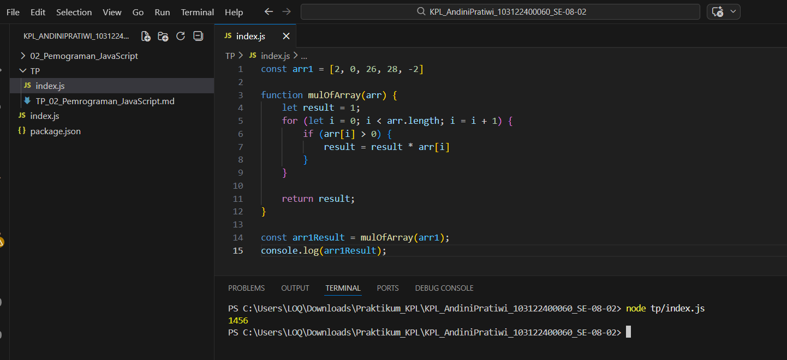

# Tugas Pendahuluan 02: Pemrograman JavaScript

**Nama:** Andini Pratiwi  
**NIM:** 103122430009  
**Kelas:** SE-08-02  
**Dosen Pengampu:** Yudha Islami Sulistiya  
**Asisten Praktikum:** Adhiansyah Muhammad Pradana Farawowan, Hamid Khaeruman  

## Soal
Kamu sudah menulis fungsi `mulOfArray`. Ujilah dengan input `[2, 0, 26, 28, -2]`, dengan output yang seharusnya adalah `1456`. Jika kamu menemukan bahwa hasilnya berbeda, bisakah kamu memperbaikinya? Jika kamu menemukan bahwa hasilnya sama, bisakah kamu menjelaskan mengapa demikian?

## Program/Kode
Tersedia di [index2.js](index2.js)

## Output

## Deskripsi
Program pada file `index.js` dan `index2.js` dibuat menggunakan JavaScript untuk menghitung hasil perkalian elemen array berdasarkan kondisi tertentu. Kedua program menggunakan fungsi `mulOfArray()` yang menerima parameter berupa array, kemudian melakukan perulangan menggunakan `for` untuk memeriksa setiap elemen array satu per satu. Hasil perkalian disimpan pada variabel `result` yang diawali dengan nilai `1`.

Pada file `index.js`, program hanya mengalikan angka yang bernilai lebih besar atau sama dengan nol (`>= 0`), sehingga bilangan negatif tidak ikut diproses. Sedangkan pada file `index2.js`, program hanya mengalikan angka yang lebih besar dari nol (`> 0`), sehingga angka nol dan bilangan negatif akan diabaikan. Setelah seluruh data selesai diproses, hasil akhir ditampilkan menggunakan `console.log()`. Program ini menerapkan konsep dasar pemrograman seperti fungsi, perulangan, percabangan, dan pengolahan array.