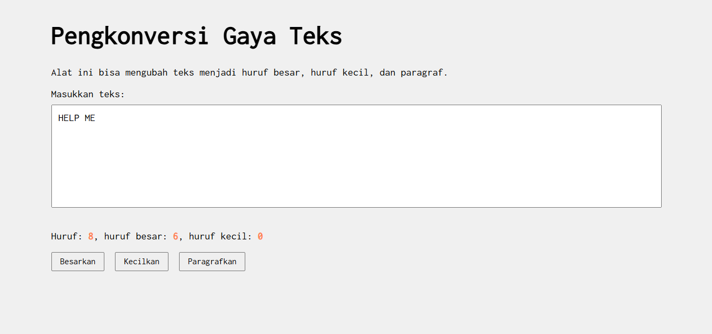

#TUGAS Pendahuluan 03: GUI dengan HTML dan CSS

Soal: Buatlah tata letak laman yang kamu buat berada di tengah seperti di bawah ini, dan juga ubah font-nya dengan Inconsolata dari Google Fonts.

kode: HTML CSS JS

Output:

Deskripsi Program =
Program ini adalah aplikasi web sederhana yang dibuat menggunakan HTML, CSS, dan JavaScript. Program ini digunakan untuk mengubah gaya teks yang dimasukkan oleh pengguna.

Pengguna dapat mengetikkan teks pada kotak yang tersedia. Setelah itu, program akan menampilkan jumlah huruf secara otomatis, termasuk jumlah huruf besar dan huruf kecil. Selain itu, tersedia tombol untuk mengubah teks menjadi huruf besar, huruf kecil, atau membuat huruf pertama menjadi kapital seperti pada paragraf.

Program ini juga menggunakan font Inconsolata dari Google Fonts agar tampilan teks lebih rapi dan mudah dibaca.