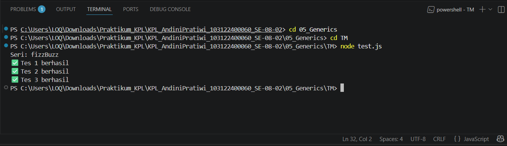

# Tugas Mandiri 05: Generics

**Nama:** Andini Pratiwi <br>
**NIM:** 103122400060 <br>
**Kelas:** SE-08-02 <br>
**Dosen Pengampu:** Yudha Islami Sulistiya <br>
**Asisten Praktikum:** Adhiansyah Muhammad Pradana Farawowan, Hamid Khaeruman <br>

## Soal
Diberikan program index.js seperti ini:
``` 
// Tambah JSDoc di sini
function zzzzOrNum(value) {
    // Ubah kode di sini
}

// Tambah JSDOC di sini
function fizzBuzz(sequence) {
    // Ubah kode di sini

    const newSequence = sequence.map((e) => zzzzOrNum(e));

    return newSequence;
}

module.exports = {
    fizzBuzz: fizzBuzz,
    zzzzOrNum: zzzzOrNum,
};
```
Aturan FizzBuzz kali ini adalah:
1. Fungsi fizzBuzz hanya menerima larik yang semua elemennya terdiri dari bilangan bulat dan mengeluarkan larik pula yang bisa jadi bercampur string dan bilangan
2. Fungsi zzzzOrNum hanya menerima sebuah data tunggal berupa bilangan bulat dan mengembalikan "Fizz", "FizzBuzz", "Buzz", atau bilanga bulat sesuai logikanya
3. Kedua fungsi harus ada dan harus disertai JSDoc sesuai tipe data yang disiratkan dari no. 1, no. 2, dan perilaku yang diharapkan di bawah
4. fizzBuzz harus menggunakan fungsi zzzzOrNum di dalamnya

Gunakan [konfigurasi ini](https://github.com/adhiansyahancha/Praktikum-KPL/blob/c8fdfd7557e5c83d81558b27687d66209d4c5b38/05_Generics/tsconfig.json) untuk `tsconfig.json` dan [test.js](https://github.com/adhiansyahancha/Praktikum-KPL/blob/c8fdfd7557e5c83d81558b27687d66209d4c5b38/05_Generics/test.js) ini untuk menguji kode yang kamu buat.

## Program/Kode
Program Tersedia di [index.js](index.js), [test.js] (test.js).

## Output


## Deskripsi
Program ini dibuat untuk menerapkan aturan FizzBuzz menggunakan dua fungsi utama, yaitu `zzzzOrNum()` dan `fizzBuzz()`. Fungsi `zzzzOrNum()` digunakan untuk memproses satu bilangan bulat dan mengembalikan `"Fizz"` jika habis dibagi 3, `"Buzz"` jika habis dibagi 5, `"FizzBuzz"` jika habis dibagi keduanya, atau angka asli jika tidak memenuhi kondisi tersebut.
Fungsi `fizzBuzz()` digunakan untuk memproses array bilangan bulat sekaligus. Setiap elemen pada array diproses menggunakan fungsi `zzzzOrNum()` dengan method `map()`, sehingga menghasilkan array baru yang berisi campuran angka dan string sesuai aturan FizzBuzz. Program juga dilengkapi validasi tipe data agar input harus berupa integer dan array yang valid.
Selain itu, setiap fungsi menggunakan JSDoc untuk mendefinisikan tipe parameter dan nilai balik sehingga dapat diperiksa oleh TypeScript melalui konfigurasi `tsconfig.json`. File `test.js` digunakan untuk menguji fungsi secara otomatis menggunakan module `assert` agar program dapat dipastikan berjalan sesuai yang diharapkan.