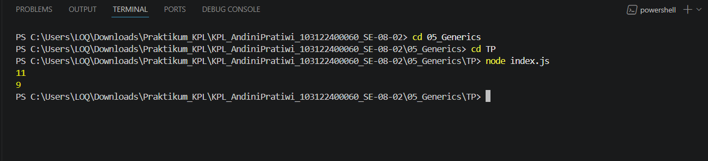

# Tugas Pendahuluan 05: Generics

**Nama:** Andini Pratiwi <br>
**NIM:** 103122400060 <br>
**Kelas:** SE-08-02 <br>
**Dosen Pengampu:** Yudha Islami Sulistiya <br>
**Asisten Praktikum:** Adhiansyah Muhammad Pradana Farawowan, Hamid Khaeruman <br>

## Soal
Ini adalah kode yang mengurus jumlah semua karakter dan jumlah huruf:
```
const str = "Bar bar";

let jumlahSemua = 0;
for (const c of str) { 
    jumlahSemua++; 
}
console.log(total);

let jumlahHuruf = 0;
for (const c of str) { 
    if (c === ' ') continue;
    jumlahHuruf++;
}
console.log(letters);
```
Bagaimana caramu hanya dengan satu fungsi generik bisa mengurus keduanya? <br>
Agar fungsi yang kamu kerjakan benar atau tidak, berikut ini adalah kode tes yang bisa kamu tempelkan:
```
const str = "Bar bar bar";
...
console.log(
   hitung(str, "semua") // Harusnya 11
);

console.log(
  hitung(str, "huruf") // Harusnya 9
);

hitung(str, "huruf"); // Tidak terjadi apa-apa
```

## Program/Kode
Program tersedia di [index.js](index.js)

## Output


## Deskripsi
Fungsi hitung(str, tipe) dibuat sebagai fungsi generik untuk menghitung jumlah karakter pada string berdasarkan jenis perhitungan yang dipilih. Parameter str digunakan sebagai input teks, sedangkan parameter tipe menentukan mode perhitungan, yaitu "semua" untuk menghitung seluruh karakter termasuk spasi, dan "huruf" untuk menghitung hanya huruf tanpa spasi.
Proses perhitungan dilakukan menggunakan perulangan for...of untuk membaca setiap karakter dalam string satu per satu. Jika tipe yang dipilih "semua", maka seluruh karakter langsung dihitung. Namun jika tipe "huruf", fungsi akan melewati karakter spasi menggunakan continue sehingga hanya huruf yang ditambahkan ke total perhitungan.
Dengan pendekatan ini, satu fungsi dapat digunakan untuk menangani beberapa kebutuhan perhitungan sekaligus tanpa perlu membuat fungsi terpisah, sehingga kode menjadi lebih ringkas, fleksibel, dan mudah dikembangkan.