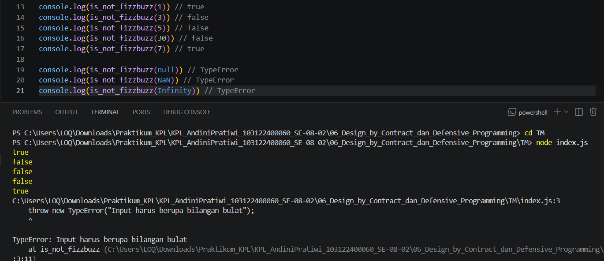

# Tugas Mandiri 06: Design by Contract dan Defensive Programming

**Nama:** Andini Pratiwi <br>
**NIM:** 103122400060 <br>
**Kelas:** SE-08-02 <br>
**Dosen Pengampu:** Yudha Islami Sulistiya <br>
**Asisten Praktikum:** Adhiansyah Muhammad Pradana Farawowan, Hamid Khaeruman <br>

## Soal
Lindungi kode ini dari bilangan-bilangan "fizz buzz"!
<br>

Tugasmu adalah membuat fungsi yang menolak bilangan-bilangan kelipatan 3, 5, atau 15, menerima bilangan-bilangan bukan "fizz buzz", dan melempar yang bukan bilangan bulat.
```
function is_not_fizzbuzz(number) {
  // TODO
}

console.log(is_not_fizzbuzz(1)) // true
console.log(is_not_fizzbuzz(3)) // false
console.log(is_not_fizzbuzz(5)) // false
console.log(is_not_fizzbuzz(30)) // false
console.log(is_not_fizzbuzz(7)) // true
console.log(is_not_fizzbuzz(null)) // Lempar TypeError
console.log(is_not_fizzbuzz(NaN)) // Lempar TypeError
console.log(is_not_fizzbuzz(Infinity)) // Lempar TypeError
```

## Program/Kode
Program Tersedia di [index.js](index.js)

## Output


## Deskripsi
Fungsi `is_not_fizzbuzz(number)` digunakan untuk memeriksa apakah suatu bilangan termasuk kategori “fizz buzz” atau bukan. Bilangan fizz buzz adalah angka yang merupakan kelipatan 3, 5, atau 15. Fungsi akan mengembalikan nilai `false` jika angka habis dibagi 3 atau 5, dan `true` jika bukan kelipatan keduanya. Selain melakukan pengecekan kelipatan, fungsi ini juga memvalidasi input agar hanya menerima bilangan bulat (integer) yang valid menggunakan `Number.isInteger()`. Jika input berupa `null`, `NaN`, `Infinity`, atau tipe data lain yang bukan integer, maka fungsi akan melempar `TypeError` sebagai penanganan error. Dengan begitu, fungsi menjadi lebih aman, valid, dan mencegah kesalahan saat proses pengecekan angka.