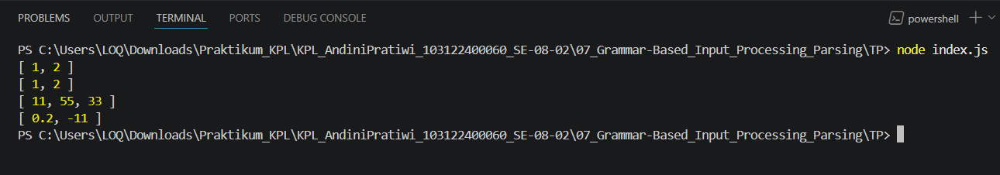

# Tugas Pendahuluan 07: Grammar-based Input Processing

**Nama:** Andini Pratiwi <br>
**NIM:** 103122400060 <br>
**Kelas:** SE-08-02 <br>
**Dosen Pengampu:** Yudha Islami Sulistiya <br>
**Asisten Praktikum:** Adhiansyah Muhammad Pradana Farawowan, Hamid Khaeruman <br>

## Soal
Buatlah fungsi yang mengubah deretan angka bertipe string menjadi larik angka.
```
function toNumberArray(number) {
  // TODO
}

console.log(toNumberArray("1, 2")) // [1, 2]
console.log(toNumberArray(["1", "2"])) // [1, 2]
console.log(toNumberArray(" 11,55,33   ")) // [11, 55, 33]
console.log(toNumberArray(["0.2", "-11", "abc23"])) // [0.2, -11]
```

## Program/Kode
Program Tersedia di [index.js](index.js)

## Output


## Deskripsi
Fungsi `toNumberArray(number)` dibuat untuk mengonversi kumpulan data angka yang masih bertipe string menjadi array dengan tipe data number. Fungsi ini mendukung dua jenis input, yaitu string yang dipisahkan tanda koma dan array yang berisi string angka. Jika input berupa string, fungsi akan memisahkan setiap nilai menggunakan `split(",")`, kemudian membersihkan spasi berlebih dengan `trim()` agar data lebih rapi sebelum diproses.
Setelah itu, setiap elemen diubah menjadi tipe number menggunakan `Number()`. Untuk menjaga validitas data, fungsi juga melakukan penyaringan menggunakan `filter()` dan `isNaN()` sehingga nilai yang bukan angka valid, seperti `"abc23"`, tidak akan dimasukkan ke hasil akhir. Dengan proses tersebut, fungsi mampu menghasilkan array yang hanya berisi angka valid dalam format numerik, sehingga lebih aman dan siap digunakan untuk operasi perhitungan atau pengolahan data selanjutnya.