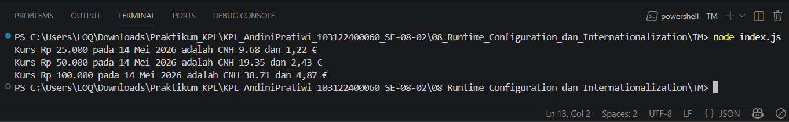

# Tugas Mandiri 08: Runtime Configuration dan Internationalization

**Nama:** Andini Pratiwi  
**NIM:** 103122400060  
**Kelas:** SE-08-02  
**Dosen Pengampu:** Yudha Islami Sulistiya  
**Asisten Praktikum:** Adhiansyah Muhammad Pradana Farawowan, Hamid Khaeruman  

## Soal
Waktunya menukar uang!

Pada tugas ini kamu akan membuat program yang menampilkan kurs rupiah (IDR) terhadap renminbi luar Tiongkok (CNH) dan euro (EUR). Gunakan [link API ini](https://cdn.jsdelivr.net/npm/@fawazahmed0/currency-api@latest/v1/currencies/idr.json) untuk mengambil data.  
Tantangan:
1. Simpanlah URL API ke dalam .env sebagai BASE_API
2. Gunakan Intl untuk memformat nilai mata uang dan waktu kamu mengambil data kurs.
3. Hapus pesan promosi dotenv

Lalu pastikan outputnya tampak seperti di bawah ini.  

Ujilah dengan Rp25000, Rp50000, dan Rp100000.
## Program/Kode
Program Tersedia di [index.js](index.js)

## Output

## Deskripsi
Program ini digunakan untuk mengambil data kurs mata uang secara online melalui API, kemudian mengonversi nilai rupiah (IDR) ke mata uang renminbi Tiongkok (CNH) dan euro (EUR). URL API disimpan di file .env menggunakan variabel BASE_API agar lebih aman dan mudah diubah tanpa mengedit kode utama.
Data kurs diambil menggunakan fetch, lalu hasil konversi ditampilkan dengan format mata uang dan tanggal yang rapi menggunakan Intl.NumberFormat serta Intl.DateTimeFormat. Program juga menyembunyikan pesan promosi bawaan dari dotenv agar output terminal lebih bersih dan profesional.
Program diuji menggunakan beberapa nominal rupiah seperti Rp25.000, Rp50.000, dan Rp100.000 untuk memastikan hasil konversi berjalan dengan benar.