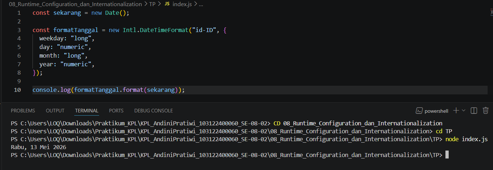

# Tugas Pendahuluan 08: Runtime Configuration dan Internationalization

**Nama:** Andini Pratiwi <br>
**NIM:** 103122400060 <br>
**Kelas:** SE-08-02 <br>
**Dosen Pengampu:** Yudha Islami Sulistiya <br>
**Asisten Praktikum:** Adhiansyah Muhammad Pradana Farawowan, Hamid Khaeruman <br>

## Soal
Tampilkan tanggal sekarang dengan format seperti ini:
```
Sabtu, 18 April 2026
```
Nilai waktu tidak harus sama, asalkan formatnya benar dan bisa tampil di komputer terpisah pada waktu tertentu. Gunakan `Intl.DateTimeFormat` (bukan string manual).

## Program/Kode
Program Tersedia di  [index.js](index.js)

## Output


## Deskripsi
Program ini digunakan untuk menampilkan tanggal saat ini dengan format lokal Indonesia menggunakan Intl.DateTimeFormat. Objek Date() digunakan untuk mengambil waktu dan tanggal terbaru dari sistem komputer. Kemudian Intl.DateTimeFormat("id-ID") dipakai untuk memformat tanggal sesuai standar Indonesia agar nama hari dan bulan tampil dalam bahasa Indonesia. Opsi weekday, day, month, dan year menentukan bagian tanggal yang ingin ditampilkan. Dengan cara ini, format tanggal akan otomatis menyesuaikan waktu pada perangkat yang menjalankan program tanpa perlu menulis string tanggal secara manual.