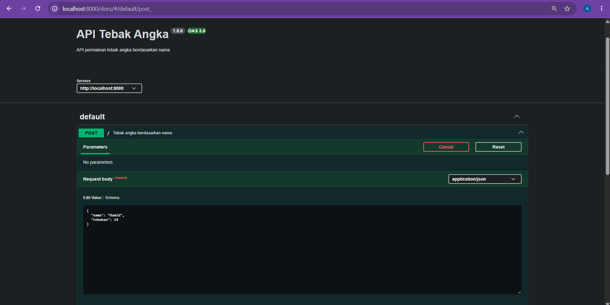
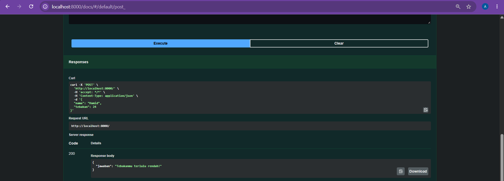

# Tugas Mandiri 09: API Design dan Construction Using Swagger

**Nama:** Andini Pratiwi <br>
**NIM:** 103122400060 <br>
**Kelas:** SE-08-02 <br>
**Dosen Pengampu:** Yudha Islami Sulistiya <br>
**Asisten Praktikum:** Adhiansyah Muhammad Pradana Farawowan, Hamid Khaeruman <br>

## Soal
Mari kita main tebak-tebakan angka acak!

Tugasmu adalah membuat API yang terdiri dari satu endpoint saja, yaitu `POST /`. Ketika kita melakkukan `POST`, formatnya adalah seperti di bawah ini. <br>
```
{
  "nama": "Hamid",
  "tebakan": 24
}
```
Jika tebakan benar. <br>
```
{
    "jawaban": "Benar sekali! Tebakannya adalah 24."
}
```
Jika tebakan terlalu tinggi. <br>
```
{
    "jawaban": "Tebakanmu terlalu tinggi!"
}
```
Jika tebakan terlalu rendah. <br>
```
{
    "jawaban": "Tebakanmu terlalu rendah!"
}
```
Beberapa aturan:
1. Angka acak yang dihasilkan harus tetap dan tidak boleh berubah setiap kali permintaan API dilakukan, tetapi boleh berubah setiap harinya atau dibuat tetap selamanya
2. Rentang harus di antara 1-100
3. Nama harus sensitif terhadap besar kecil huruf (mis. hamid dan Hamid akan menghasilkan angka acak yang berbeda)
4. Tidak menggunakan pustaka apapun, murni mengandalkan nama dan tebakan

Penjelasan untuk nomor 1: Jika namanya `Hamid`, ia akan diharapkan tetap pada nilai tebakan 24 mau kamu melakukan 100 kali permintaan. Tidak ada jawaban benar di sini (`Hamid` tidak harus `24`, bebas mau dibuat acak seperti apa yang penting harus tetap).

## Program Kode
Program tersedia di [index.js](index.js) dan [swagger.js](swagger.js)

## Output



## Deskripsi
Program ini merupakan API permainan tebak angka berbasis REST API menggunakan Express.js dan Swagger. API menerima input berupa nama dan angka tebakan melalui metode POST. Sistem akan menghasilkan angka tertentu berdasarkan nama pengguna secara konsisten, sehingga nama yang sama akan selalu memiliki jawaban angka yang sama. Setelah menerima tebakan, API akan memberikan respon apakah tebakan terlalu tinggi, terlalu rendah, atau benar. Dokumentasi API juga disediakan menggunakan Swagger agar endpoint dapat diuji dan dipahami dengan lebih mudah.