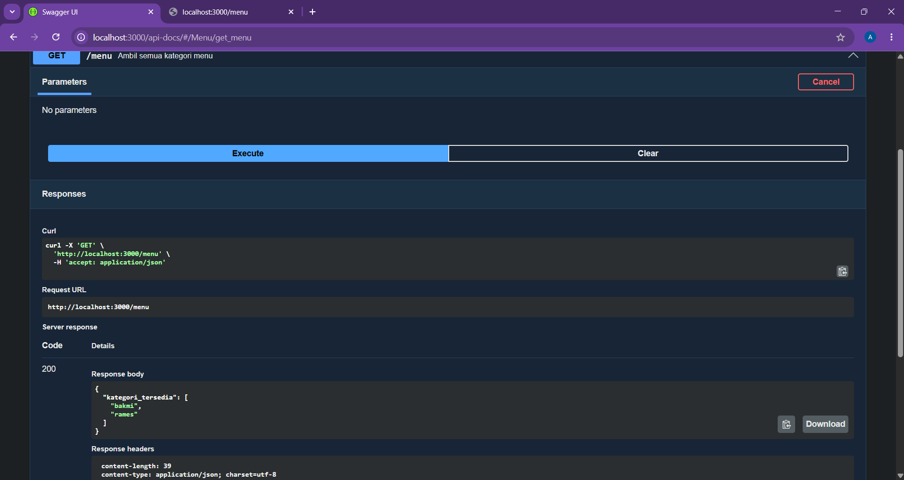
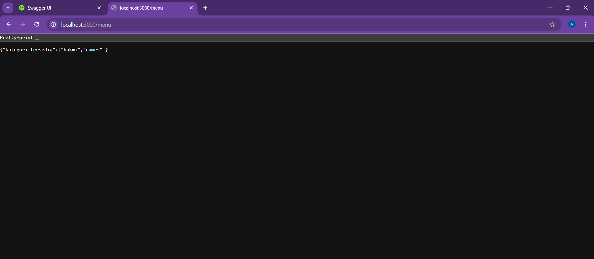

# Tugas Pendahuluan 09: API Design dan Construction Using Swagger

**Nama:** Andini Pratiwi  
**NIM:** 103122400060  
**Kelas:** SE-08-02  
**Dosen Pengampu:** Yudha Islami Sulistiya  
**Asisten Praktikum:** Adhiansyah Muhammad Pradana Farawowan, Hamid Khaeruman  

## Soal
Buatlah satu endpoint lagi beserta dokumentasi OpenAPI-nya, yaitu `GET /menu` yang menampilkan daftar semua nama kategori menu yang ada.

Dokumentasi:
  

Hasil `GET`:  

## Program/Kode
Program Tersedia di [index.js](index.js) dan  [swagger.js](swagger.js)

## Output

## Deskripsi
Endpoint GET /menu dibuat untuk menampilkan daftar kategori menu yang tersedia pada data menu restoran atau aplikasi. Endpoint ini menggunakan method HTTP GET karena fungsinya hanya mengambil data tanpa melakukan perubahan pada server. Saat endpoint dipanggil, sistem akan membaca seluruh data menu, kemudian mengambil nilai kategori dari setiap item menggunakan map(). Setelah itu, data kategori disaring agar tidak ada duplikasi dengan memanfaatkan Set, sehingga hasil akhir hanya berisi kategori yang unik.
Hasil respons dikembalikan dalam format JSON dengan properti kategori_tersedia yang berisi array nama kategori. Dengan pendekatan ini, client atau frontend dapat mengetahui seluruh kategori menu yang tersedia tanpa perlu memproses data menu satu per satu. Endpoint ini berguna untuk kebutuhan filter menu, navigasi kategori, atau pengelompokan data pada aplikasi.
Selain endpoint, program juga dilengkapi dokumentasi OpenAPI/Swagger agar API lebih mudah dipahami dan diuji. Dokumentasi Swagger dibuat pada file terpisah (swagger.js) untuk memisahkan konfigurasi dokumentasi dengan logika utama server sehingga struktur project menjadi lebih rapi dan modular. Library swagger-jsdoc digunakan untuk membaca komentar dokumentasi pada endpoint, sedangkan swagger-ui-express digunakan untuk menampilkan halaman dokumentasi interaktif di browser.
Dengan adanya dokumentasi Swagger, developer dapat melihat daftar endpoint, method HTTP, response, serta mencoba API langsung melalui halaman /api-docs tanpa menggunakan aplikasi tambahan seperti Postman. Implementasi ini menunjukkan konsep REST API, modularisasi file, penggunaan Express.js, serta penerapan dokumentasi API yang umum digunakan dalam pengembangan backend modern.