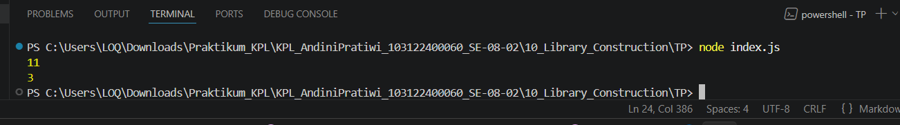

# Tugas Pendahuluan 10: Library Construction

**Nama:** Andini Pratiwi  
**NIM:** 103122400060  
**Kelas:** SE-08-02  
**Dosen Pengampu:** Yudha Islami Sulistiya  
**Asisten Praktikum:** Adhiansyah Muhammad Pradana Farawowan, Hamid Khaeruman  

## Soal
Buatlah pustaka JavaScript yang menyediakan utilitas berupa dua fungsi yang menghitung jumlah huruf dan jumlah kata.

Kriteria:
1. Hanya alfabet A hingga Z yang dihitung (besar dan kecil)
2. Spasi tidak dihitung
3. Pustaka bisa diimpor

## Program Kode
Program tersedia di [index.js](index.js) dan [textUtils.js](textUtils.js)

## Output

## Deskripsi
Pustaka ini menyediakan dua fungsi utilitas, yaitu hitungHuruf() dan hitungKata(). Fungsi hitungHuruf() digunakan untuk menghitung jumlah karakter alfabet dari A–Z, baik huruf besar maupun kecil, tanpa menghitung spasi, angka, atau simbol lainnya. Sementara itu, fungsi hitungKata() digunakan untuk menghitung jumlah kata yang hanya terdiri dari alfabet menggunakan regular expression.
Agar pustaka dapat digunakan di file lain, kedua fungsi diekspor menggunakan module.exports, kemudian dapat diimpor kembali dengan require(). Dengan pendekatan ini, kode menjadi lebih modular, reusable, dan mudah digunakan pada berbagai program JavaScript lainnya.