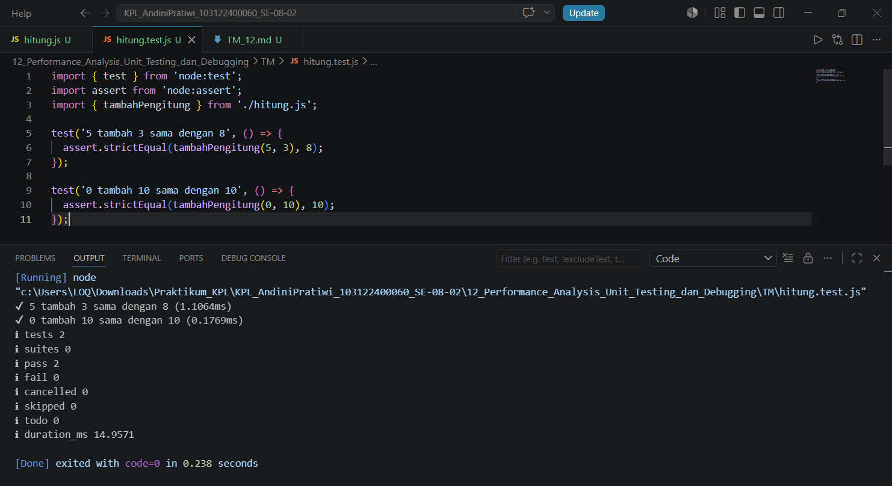

# Tugas Mandiri 12: Performance Analysis, Unit Testing, dan Debugging

**Nama:** Andini Pratiwi <br>
**NIM:** 103122400060 <br>
**Kelas:** SE-08-02 <br>
**Dosen Pengampu:** Yudha Islami Sulistiya <br>
**Asisten Praktikum:** Adhiansyah Muhammad Pradana Farawowan, Hamid Khaeruman <br>

## Soal
Tambah dan tambah!

Fungsi di bawah ini melakukan penjumlaha pada penghitung (counter), yang sesederhana menambahk jumlah jika kamu menekan tombol. <br>
`hitung.js`
```
function tambahPengitung(terkini, jumlah) {
  terkini = terkini + jumlah;
  return terkini;
}
```
`hitung.test.js`
```
import { test } from 'node:test';
import assert from 'node:assert';
import { tambahPengitung } from './hitung.js';

test('5 tambah 3 sama dengan 8', () => {
  assert.strictEqual(tambahPengitung(5, 3), 8);
});

test('0 tambah 10 sama dengan 10', () => {
  assert.strictEqual(tambahPengitung(0, 10), 10);
});

```
Bisakah kamu tunjukkan apakah kode sudah benar atau bagian mana yang perlu diperbaiki beserta alasannya?

## Program Kode
Program tersedia di [hitung.js](hitung.js) dan [hitung.test.js](hitung.test.js)

## Output


## Deskripsi
Kode yang diberikan berfungsi untuk menambahkan nilai jumlah ke nilai terkini pada sebuah penghitung (counter). Secara logika, fungsi tambahPengitung() sudah berjalan dengan benar karena mengembalikan hasil penjumlahan dari kedua parameter yang diberikan.

Pada file pengujian (hitung.test.js), terdapat dua test case:

1. Memastikan nilai 5 ditambah 3 menghasilkan 8.
2. Memastikan nilai 0 ditambah 10 menghasilkan 10.

Kedua test tersebut sudah sesuai dengan tujuan fungsi dan akan menghasilkan status lulus (passed) apabila fungsi bekerja dengan benar.

Namun, terdapat satu hal yang perlu diperhatikan. Karena file test menggunakan sintaks:

import { tambahPengitung } from './hitung.js';

maka fungsi pada file hitung.js harus diekspor menggunakan keyword export. Jika tidak, program akan menghasilkan error saat dijalankan karena fungsi tidak dapat ditemukan oleh file test.