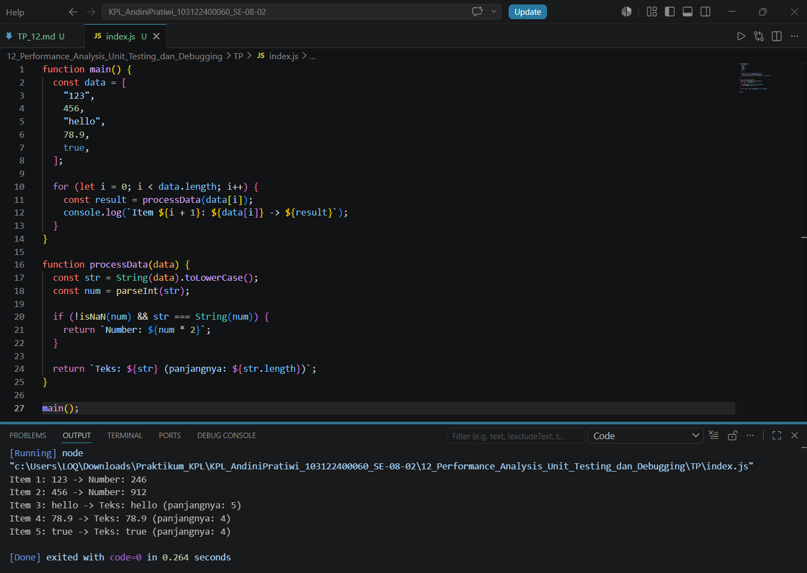

# Tugas Pendahuluan 12: Performance Analysis, Unit Testing, dan Debugging

**Nama:** Andini Pratiwi <br>
**NIM:** 103122400060 <br>
**Kelas:** SE-08-02 <br>
**Dosen Pengampu:** Yudha Islami Sulistiya <br>
**Asisten Praktikum:** Adhiansyah Muhammad Pradana Farawowan, Hamid Khaeruman <br>

## Soal
Cobalah untuk menangkap kecacatan dalam kode ini
```
function main() {
  const data = [
    "123",
    456,
    "hello",
    78.9,
    true,
  ];

  for (let i = 0; i < data.length; i++) {
    const result = processData(data[i]);
    console.log(`Item ${i + 1}: ${data[i]} -> ${result}`);
  }
}

function processData(data) {
  const str = data.toLowerCase();
  const num = parseInt(str);
  if (!isNaN(num) && str === String(num)) {
    return `Number: ${num * 2}`;
  }
  return `Teks: ${str} (panjangnya: ${str.length})`;
}

main();
```

## Program Kode
Program tersedia di [index.js](index.js)

## Output


## Deskripsi
Program ini digunakan untuk memproses beberapa jenis data yang terdapat dalam array, seperti string, angka, dan boolean. Setiap data akan diperiksa menggunakan fungsi processData(). Jika data berupa angka, nilainya akan dikalikan 2. Jika bukan angka, program akan menampilkan data tersebut sebagai teks beserta panjang karakternya.

Pada kode awal terdapat bug karena method toLowerCase() dipanggil pada semua tipe data, padahal method tersebut hanya bisa digunakan pada string. Solusinya adalah mengubah data menjadi string terlebih dahulu dengan String(data) sehingga program dapat berjalan tanpa error.

**Kode Awal:**
```
function main() {
  const data = [
    "123",
    456,
    "hello",
    78.9,
    true,
  ];

  for (let i = 0; i < data.length; i++) {
    const result = processData(data[i]);
    console.log(`Item ${i + 1}: ${data[i]} -> ${result}`);
  }
}

function processData(data) {
  const str = data.toLowerCase();
  const num = parseInt(str);
  if (!isNaN(num) && str === String(num)) {
    return `Number: ${num * 2}`;
  }
  return `Teks: ${str} (panjangnya: ${str.length})`;
}

main();
```
**Kode Setelah Debugging:**
```
function main() {
  const data = [
    "123",
    456,
    "hello",
    78.9,
    true,
  ];

  for (let i = 0; i < data.length; i++) {
    const result = processData(data[i]);
    console.log(`Item ${i + 1}: ${data[i]} -> ${result}`);
  }
}

function processData(data) {
  const str = String(data).toLowerCase();
  const num = parseInt(str);

  if (!isNaN(num) && str === String(num)) {
    return `Number: ${num * 2}`;
  }

  return `Teks: ${str} (panjangnya: ${str.length})`;
}

main();