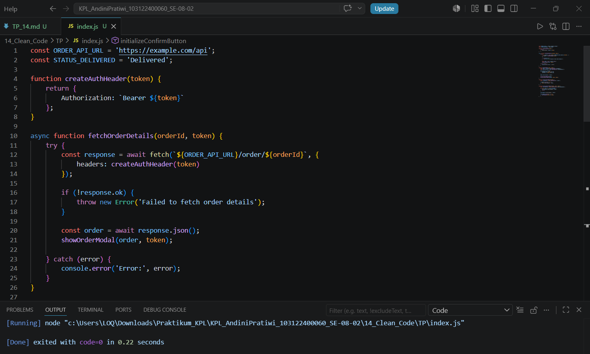

# Tugas Pendahuluan 14: Clean Code

**Nama:** Andini Pratiwi <br>
**NIM:** 103122400060 <br>
**Kelas:** SE-08-02 <br>
**Dosen Pengampu:** Yudha Islami Sulistiya <br>
**Asisten Praktikum:** Adhiansyah Muhammad Pradana Farawowan, Hamid Khaeruman <br>

## Soal
Kode ini tampak baik dan bagus, tetapi menyalahi beberapa prinsip kode bersih. Bisakah kamu melakukan refaktorisasi? Dimodifikasi dari [amrrwael/Delivery-website-Hits](https://github.com/amrrwael/Delivery-website-Hits).

Sebagai konteks, fungsi di bawah ini menampilkan rincian pesanan di modal dan jika klik konfirmasi, sistem apa menyimpannya.
```
function fetchOrderDetails(orderId, token) {
    fetch(`https://example.com/api/order/${orderId}`, {
        headers: {
            'Authorization': token
        }
    })
    .then(response => {
        if (!response.ok) {
            throw new Error('Failed to fetch order details');
        }
        return response.json();
    })
    .then(order => {
        // Display order info
        const modal = document.getElementById('orderModal');
        const detailsDiv = modal.querySelector('#orderDetails');
        detailsDiv.innerHTML = '';

        const header = document.createElement('h3');
        header.textContent = `Order ID: ${order.id}`;
        detailsDiv.appendChild(header);

        const status = document.createElement('p');
        status.textContent = `Status: ${order.status}`;
        detailsDiv.appendChild(status);

        // Show modal
        modal.style.display = 'block';

        // Setup close button
        const closeBtn = modal.querySelector('.close');
        closeBtn.addEventListener('click', () => {
            modal.style.display = 'none';
        });

        // Setup confirm button
        const confirmBtn = modal.querySelector('#confirmOrderBtn');
        if (order.status === 'Delivered') {
            confirmBtn.style.display = 'none';
        } else {
            confirmBtn.addEventListener('click', () => {
                confirmOrder(order.id, token);
            });
        }
    })
    .catch(error => {
        console.error('Error:', error);
    });
}
```

## Program Kode
Program tersedia di [index.js](index.js)

## Output


## Deskripsi

Sumber: [Delivery-website-Hits](https://github.com/amrrwael/Delivery-website-Hits)

Kode Sebelum Refaktorisasi (Original):
```javascript
function fetchOrderDetails(orderId, token) {
    fetch(`https://example.com/api/order/${orderId}`, {
        headers: {
            'Authorization': token
        }
    })
    .then(response => {
        if (!response.ok) {
            throw new Error('Failed to fetch order details');
        }
        return response.json();
    })
    .then(order => {
        const modal = document.getElementById('orderModal');
        const detailsDiv = modal.querySelector('#orderDetails');
        detailsDiv.innerHTML = '';

        const header = document.createElement('h3');
        header.textContent = `Order ID: ${order.id}`;
        detailsDiv.appendChild(header);

        const status = document.createElement('p');
        status.textContent = `Status: ${order.status}`;
        detailsDiv.appendChild(status);

        modal.style.display = 'block';

        const closeBtn = modal.querySelector('.close');
        closeBtn.addEventListener('click', () => {
            modal.style.display = 'none';
        });

        const confirmBtn = modal.querySelector('#confirmOrderBtn');
        if (order.status === 'Delivered') {
            confirmBtn.style.display = 'none';
        } else {
            confirmBtn.addEventListener('click', () => {
                confirmOrder(order.id, token);
            });
        }
    })
    .catch(error => {
        console.error('Error:', error);
    });
}
```
**Penjelasan =**
Kode awal memiliki beberapa tanggung jawab dalam satu fungsi, yaitu mengambil data dari API, menampilkan modal, serta mengatur event tombol. Hal ini melanggar prinsip Single Responsibility Principle karena satu fungsi melakukan terlalu banyak pekerjaan.

Pada refaktorisasi, kode dipecah menjadi beberapa fungsi yang memiliki tugas masing-masing, yaitu fetchOrderDetails(), displayOrderModal(), setupCloseButton(), dan setupConfirmButton(). Selain itu, penggunaan async/await membuat kode lebih mudah dibaca dibandingkan penggunaan .then() yang bertingkat.

Dengan refaktorisasi ini, kode menjadi lebih rapi, mudah dipahami, dan lebih mudah dipelihara apabila terdapat perubahan di kemudian hari.

Kode Sesudah Refaktorisasi (Refactored)

```javascript
const ORDER_API_URL = 'https://example.com/api';
const STATUS_DELIVERED = 'Delivered';

function createAuthHeader(token) {
    return {
        Authorization: `Bearer ${token}`
    };
}

async function fetchOrderDetails(orderId, token) {
    try {
        const response = await fetch(`${ORDER_API_URL}/order/${orderId}`, {
            headers: createAuthHeader(token)
        });

        if (!response.ok) {
            throw new Error('Failed to fetch order details');
        }

        const order = await response.json();
        showOrderModal(order, token);

    } catch (error) {
        console.error('Error:', error);
    }
}

function showOrderModal(order, token) {
    const modal = document.getElementById('orderModal');
    const detailsSection = modal.querySelector('#orderDetails');

    detailsSection.innerHTML = `
        <h3>Order ID: ${order.id}</h3>
        <p>Status: ${order.status}</p>
    `;

    modal.style.display = 'block';

    initializeCloseButton(modal);
    initializeConfirmButton(modal, order, token);
}

function initializeCloseButton(modal) {
    const closeButton = modal.querySelector('.close');

    closeButton.onclick = () => {
        modal.style.display = 'none';
    };
}

function initializeConfirmButton(modal, order, token) {
    const confirmButton = modal.querySelector('#confirmOrderBtn');

    if (order.status === STATUS_DELIVERED) {
        confirmButton.style.display = 'none';
        return;
    }

    confirmButton.style.display = 'block';

    confirmButton.onclick = () => {
        confirmOrder(order.id, token);
    };
}
```